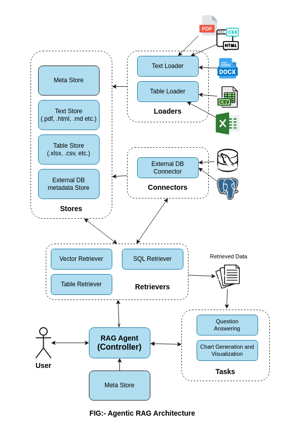

# AgenticRAG Documentation

## Table of Contents
- [Introduction](#introduction)
- [Architecture Overview](#architecture-overview)
- [Quickstart](quickstart.md)
- [Core Components](01-stores.md)
  - [1. Stores](01-stores.md)
  - [2. Loaders](02-loaders.md)
  - [3. Connectors](03-connectors.md)
  - [4. Retrievers](04-retrievers.md)
  - [5. Tasks](05-tasks.md)
  - [6. RAGAgent](06-ragagent.md)
- [Examples](/examples)

## Introduction

AgenticRAG is a comprehensive library for building flexible Retrieval-Augmented Generation (RAG) systems. It provides a modular architecture that allows developers to customize each component according to their specific requirements while maintaining compatibility across the system.

This library solves several key challenges in building RAG applications:
- Managing diverse data types (text, tables, databases) through a unified interface
- Simplifying data ingestion from various sources
- Providing flexible retrieval mechanisms adapted to different data types
- Supporting multiple downstream tasks using retrieved context
- Enabling easy customization at any level of the stack

## Architecture Overview

The AgenticRAG system follows a modular, layered architecture where each component has specific responsibilities:

1. **Data Storage Layer**: Stores maintain structured representations of various data types
2. **Data Ingestion Layer**: Loaders and Connectors handle importing data into stores
3. **Data Retrieval Layer**: Retrievers access relevant information based on queries
4. **Task Execution Layer**: Tasks perform operations using retrieved context
5. **Orchestration Layer**: RAGAgent coordinates all components to fulfill user requests

This design follows key principles:
- **Separation of concerns**: Each component handles distinct responsibilities
- **Extensibility**: Custom implementations can be created for any component
- **Loose coupling**: Components interact through well-defined interfaces
- **Progressive disclosure**: Simple use cases are easy, while complex customization is possible
